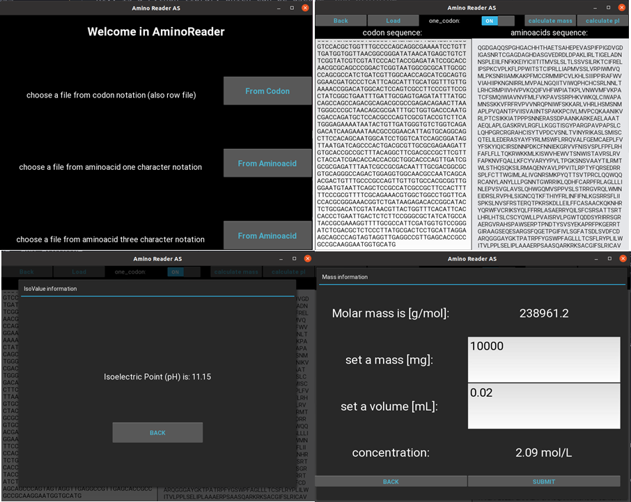

# AminoReader

AminoReader is a free, open-source, and user-friendly program to read aminoacids sequence written in Python and Kivy.
Kivy is a Python library which can be used to create applications on Windows, Linux, macOS, Android, and iOS with
GUI framework (Graphical User Interface).

AminoReader provides flexible, three options for loading a file.  
For instance, the row file contains the sequence of codons that can be uploaded. Moreover, it also allows to
load a file consisting of aminoacids sequence in one-character and three-character notation.

AminoReader also provides mass calculation and isoelectric point (pI) of investigated protein.
Isoelectric point (pI) is a pH in which the net charge of the protein is zero.
In the case of proteins, the isoelectric point mostly depends on seven charged amino acids:
glutamate, aspartate, cysteine, tyrosine, histidine, lysine, and arginine.

The repository contains example files in the docs folder, appropriate to every three options of loading:
codon_notation.txt, aminoacid_one_character.txt, aminoacid_three_character.txt, respectively.

## Setup

### Install packages
`pip3 install -r requirements.txt`

### Run the program
You simply run command:
`python3 App.py` from root directory

### Testing the application
Choosing:
- "From Codon" button, than Load btn and choose from Aminoreader downloaded folder /docs/examples/codon_notation.txt

- "From Aminoacid" button, than Load btn and choose from Aminoreader downloaded folder /docs/examples/aminoacid_one_character_one.txt

- "From Aminoacid" button, than Load btn and choose from Aminoreader downloaded folder /docs/examples/aminoacid_three_character_one.txt

#### Screens from the program

